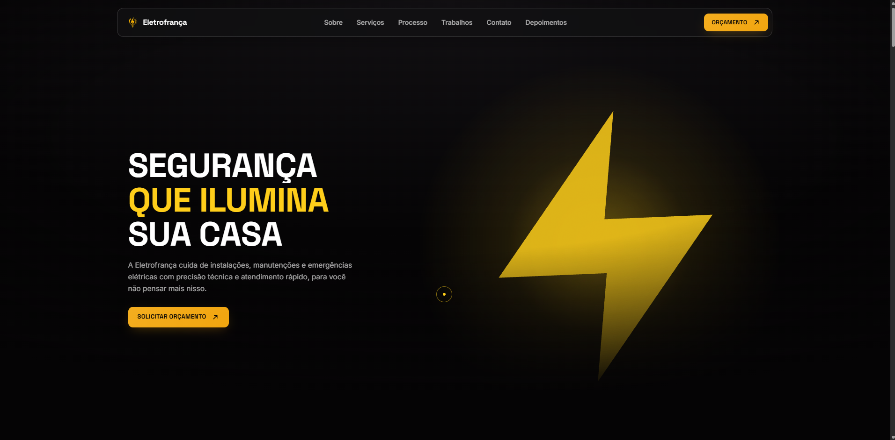
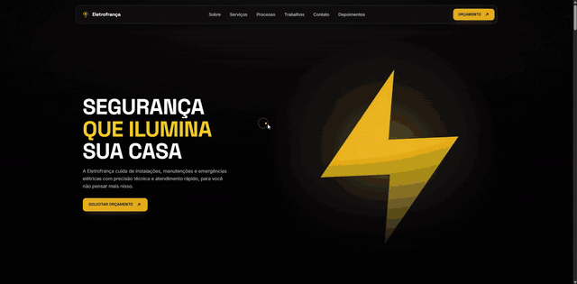

<div align="center">

# ⚡ Eletrofrança

**Site institucional de manutenções elétricas residenciais**

Segurança que ilumina sua casa — instalações, manutenções e emergências elétricas.


### 🌐 [**Ver o site ao vivo → eletro-franca.vercel.app**](https://eletro-franca.vercel.app/)

Feito com 💛 pela **[Nebula](https://www.instagram.com/webisnebula/)** para a **[@eletrofranca_](https://www.instagram.com/eletrofranca_/)**

<br>

<a href="https://eletro-franca.vercel.app/">
  
</a>

</div>

---

## 🎬 Demonstração

<div align="center">

<a href="docs/demo.mp4">
  
</a>

**[▶️ Assistir em alta qualidade (MP4, 32 s)](docs/demo.mp4)** · **[🌐 Abrir o site ao vivo](https://eletro-franca.vercel.app/)**

</div>

---

## ✨ Sobre o projeto

Landing page **one-page**, 100% estática (sem backend, sem painel, sem build), com foco em animação e identidade visual: tema escuro, amarelo `#fecd1a` como destaque e um raio 3D no hero.

### 🧭 Seções

| # | Seção | O que tem |
|---|-------|-----------|
| 1 | **Hero** | Raio 3D (Three.js) com glow e parallax do mouse, animação de entrada após o preloader |
| 2 | **Sobre** | Card em gradiente com arte responsiva (`<picture>` com 4 recortes) e entrada presa ao scroll (scrub) |
| 3 | **Serviços** | Carrossel autoplay contínuo (CSS puro), hover, botão de pausar |
| 4 | **Métricas** | Faixa amarela com números que contam de 0 até o valor ao aparecer na tela |
| 5 | **Processo** | Timeline vertical "Como trabalhamos": lados alternados, linha que se preenche em amarelo com o scroll |
| 6 | **Trabalhos** | Galeria em mosaico com 14 fotos reais e lightbox (setas, Esc, swipe) |
| 7 | **Contato** | Card de CTA "flutuando" entre dois fundos, botões de WhatsApp e Instagram |
| 8 | **Depoimentos** | 3 cards de clientes |
| 9 | **Footer** | Minimalista, com links, redes sociais e crédito |

---

## 🚀 Como rodar

Não precisa instalar nada. É só servir a pasta com qualquer servidor estático:

```bash
python -m http.server 8843
```

Depois abra **http://localhost:8843**.

> 💡 O `http.server` do Python não envia `Cache-Control`, então o navegador cacheia CSS/JS. Por isso o `index.html` usa uma versão manual na query string (`css/style.css?v=63`, `js/main.js?v=63`). **Aumente o número sempre que mexer nesses arquivos.**

---

## 🗂️ Estrutura

```
EletroFranca/
├── index.html          # marcação de todas as seções + SEO (canonical, Open Graph, JSON-LD)
├── robots.txt          # permite indexação e aponta o sitemap
├── sitemap.xml         # URL do site para os buscadores
├── css/
│   └── style.css       # tokens (:root), componentes e seções, na ordem da página
├── js/
│   └── main.js         # GSAP/ScrollTrigger, Three.js, carrossel, métricas, timeline, galeria
├── Imgs/
│   ├── Logo-Mini_NB.webp        # logo (navbar/rodapé/preloader)
│   ├── Logo-Mini_NB-64.png      # favicon
│   ├── og-image.jpg             # imagem de compartilhamento (1200×630)
│   ├── Servicos/                # cards do carrossel (.webp)
│   └── Sobre/                   # arte do card "Sobre" (4 recortes .webp)
├── trabalhos/          # fotos da galeria (obra-01.webp … obra-14.webp)
└── docs/
    ├── screenshots/Hero.png     # capa do README
    ├── preview.gif              # prévia animada do README
    └── demo.mp4                 # demonstração em vídeo (1280×630, ~2 MB)
```

---

## 🛠️ Como editar o conteúdo

<details>
<summary><strong>📞 Trocar o número de WhatsApp</strong></summary>

O número aparece em 4 links do `index.html` (menu, hero, CTA e rodapé), no formato `55` + DDD + número:

```
https://wa.me/5514991364626?text=...
```

Para trocar em todos de uma vez:

```bash
sed -i 's/5514991364626/55SEUNUMERO/g' index.html
```
</details>

<details>
<summary><strong>🧰 Serviços (carrossel)</strong></summary>

Edite o array `SERVICES` no topo da seção "SERVIÇOS" do `js/main.js`:

```js
{ img: "Manutencao_Card.webp", title: "Manutenção Preventiva", desc: "Inspeção completa…" }
```

A imagem vai em `Imgs/Servicos/` e deve ter proporção **1500 × 1340** (o card usa essa proporção para não cortar nada). A lista é duplicada em JS só para o loop fechar sem "pulo".
</details>

<details>
<summary><strong>🖼️ Adicionar fotos na galeria</strong></summary>

1. Converta a foto para WebP e coloque em `trabalhos/` (ex.: `obra-15.webp`).
2. Adicione uma linha em `WORK_ITEMS` no `js/main.js` **com a largura e a altura reais** (evita pulo de layout):

```js
{ file: "obra-15.webp", w: 960, h: 1280, title: "Legenda da foto" },
```

O mosaico, o lightbox e o contador ("3 / 15") se ajustam sozinhos.
</details>

<details>
<summary><strong>🔢 Números das Métricas</strong></summary>

No `index.html`, cada número tem `data-count` (valor final) e `data-decimals` (casas decimais). O texto dentro do `<span>` é o valor de reserva caso o JS não rode.

```html
<span data-count="500" data-decimals="0">500</span>
```
</details>

<details>
<summary><strong>💬 Depoimentos e passos do Processo</strong></summary>

São HTML puro no `index.html` (`.testi-card` e `.tl-item`). Para adicionar um passo à timeline, copie um `<li class="tl-item">` — a linha e os pontos se medem sozinhos.
</details>

---

## 🎨 Design tokens

Definidos em `:root` no `css/style.css`:

| Token | Valor | Uso |
|-------|-------|-----|
| `--yellow` | `#fecd1a` | destaque principal |
| `--orange` | `#f1a40f` | 2º tom do gradiente 135° |
| `--bg` | `#050405` | fundo do site |
| `--bg-gallery` | `#14161b` | fundo da galeria (preto grafite) |
| `--ink` / `--ink-muted` / `--ink-faint` | branco 100% / 64% / 60% | textos |
| `--font-display` | Space Grotesk | títulos |
| `--font-body` | Inter | corpo |

---

## 🖼️ Otimização de imagens

Todas as imagens são **WebP**. Para converter uma nova foto (Python + Pillow):

```python
from PIL import Image
im = Image.open("foto.jpg").convert("RGB")
im.save("obra-15.webp", "WEBP", quality=78, method=6)
```

Os PNGs originais dos cards pesavam ~3 MB cada; em WebP ficaram com 23–38 KB (o site inteiro tem ~1,6 MB).

---

## ♿ Acessibilidade e desempenho

- Contraste mínimo de 4,5:1 nos textos (botões amarelos com texto preto)
- Foco visível por teclado, link "Pular para o conteúdo" e menu mobile que não recebe foco quando fechado
- Lightbox com foco preso, Esc, setas e swipe; alvos de toque ≥ 44px
- `prefers-reduced-motion` respeitado (carrossel, contagem, timeline e galeria sem animação)
- Carrossel com botão de **pausar** e cópia decorativa oculta para leitores de tela
- Scripts com `defer`, imagens com dimensões declaradas e `loading="lazy"`

---

## 🔎 SEO

- **SEO local:** `title` e `description` com **Bauru** e **Lençóis Paulista**, `areaServed` no JSON-LD e as cidades escritas no rodapé
- `title` e `description` únicos, `canonical`, `robots` e `lang="pt-BR"`
- **Open Graph** e **Twitter Card** com imagem 1200×630 (`Imgs/og-image.jpg`) para o link ficar com preview no WhatsApp, Instagram e redes
- Dados estruturados **JSON-LD** (`schema.org/Electrician`) com nome, telefone e Instagram
- `robots.txt` + `sitemap.xml`
- ⚠️ Se o domínio mudar, atualize a URL `https://eletro-franca.vercel.app/` no `index.html` (canonical, `og:url`, `og:image`, JSON-LD), no `robots.txt` e no `sitemap.xml`.

---

## 🌐 Deploy

Publicado na **Vercel** em **https://eletro-franca.vercel.app/** (cada `git push` na `main` publica sozinho).

Não há etapa de build: para publicar em outro lugar, use a **raiz do repositório** em qualquer hospedagem estática (GitHub Pages, Netlify, Cloudflare Pages…). Na Vercel: *Framework Preset* = `Other`, sem *Build Command* e sem *Output Directory*.

---

## 📄 Licença

Projeto proprietário, desenvolvido sob encomenda para a Eletrofrança. Todos os direitos reservados.

<div align="center">

⚡ **Eletrofrança** — segurança que ilumina sua casa · Feito pela **Nebula**

</div>
